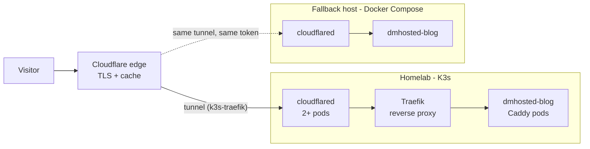

I have been learning Kubernetes for a while, and when the idea of starting a blog popped into my mind, I knew it would have been a good way to make a recap of all the things I had learned so far.
I had it as a requirement from the start to be able to run the blog on my own infra, and this allowed me to take part in the whole process from writing an article, to building the website, deploying it on the cluster, and observing its behavior when visitors would come in.

In this article, I'll go through the full set up I am using to generate, host, and monitor this very blog.

## Generating the blog

I am using [Hugo](https://gohugo.io/) to generate the static website.
I had considered other alternatives, but being Hugo very lightweight (no _Node modules_...) and very fast to build (in the order of _ms_), I quickly settled on it.
It is also very easy to extend (even for someone like me who had never actually wrote any actual frontend code until then), and it is a very nice Golang project overall.

The website code and content live on [GitHub](https://github.com/davmacario/dmhosted-blog), and everything past `git push` happens in GitHub Actions:

- [Semantic Release](https://semantic-release.org/) reads the conventional commits landing on `main`, decides whether a new version should be released, and creates the tag and the GitHub release autonomously
- A container image is built for every release, for both `linux/amd64` and `linux/arm64`, and pushed to GHCR tagged with the released version

The container itself is based on [Caddy](https://caddyserver.com/) (a webserver I had been wanting to try out for the longest time), and it is just exposing the statically-built website:

```caddyfile
:8080 {
  root * /srv

  encode gzip zstd

  # Healthcheck endpoint
  @health path /healthz
  respond @health "ok" 200

  # Static assets, can cache
  @static path *.css *.js *.woff2 *.svg *.png *.jpg *.jpeg *.webp *.ico
  header @static Cache-Control "public, max-age=31536000, immutable"

  # HTML, never cache
  @html path *.html /
  header @html Cache-Control "public, max-age=0, must-revalidate"

  file_server
}
```

> [!TIP]
>
> The `Cache-Control` header can be interpreted by Cloudflare to allow caching specific resources at the edge.

Deploying the website then just becomes a problem of running the built container _somewhere_, and making it accessible publicly in a secure way.

## Deploying the blog

> [!NOTE] Disclaimer
>
> This deployment setup is _very overkill_ for a static website, but it would not be fun otherwise!

I decided on deploying the container on my homelab, which is a 3-node Kubernetes ([K3s](https://k3s.io/)) cluster, and expose it publicly via a [Cloudflare tunnel](https://developers.cloudflare.com/cloudflare-one/networks/connectors/cloudflare-tunnel/).

### Kubernetes Deployment

The blog is a stateless application, as it is just a web server serving static files, so it can be deployed using a Kubernetes `Deployment`.
[Here](https://github.com/davmacario/dmhosted-infra/blob/main/kubernetes/apps/dmhosted-blog/deployment.yaml) is the definition of the one currently running in my cluster.

It is a very basic `Deployment`, with a few things worth pointing out:

- The container runs as a non-root user, with a read-only root filesystem and all capabilities dropped; Caddy still wants somewhere to write its config and data directories, so `/tmp` is an in-memory `emptyDir`
- Readiness and liveness probes hit the `/healthz` endpoint defined in the `Caddyfile` [above](#generating-the-blog)
- `topologySpreadConstraints` try to keep replicas on separate nodes, so that losing a node doesn't take the blog down with it

Alongside the `Deployment`, I created a [`Service`](https://github.com/davmacario/dmhosted-infra/blob/main/kubernetes/apps/dmhosted-blog/service.yaml) and a Traefik [`IngressRoute`](https://github.com/davmacario/dmhosted-infra/blob/main/kubernetes/apps/dmhosted-blog/ingressroute.yaml), allowing to reach the pods from outside the cluster network (but no public route configured yet).

Being the very optimistic person I am, I also deployed a `HorizontalPodAutoscaler` that will automatically scale the number of pods running the blog when either the CPU or the memory usage exceed 75% of the requests (made via the `Deployment`).
I don't expect this blog to blow up anytime soon, but better safe than sorry.

Here's the [manifest](https://github.com/davmacario/dmhosted-infra/blob/main/kubernetes/apps/dmhosted-blog/hpa.yaml):

```yaml
apiVersion: autoscaling/v2
kind: HorizontalPodAutoscaler
metadata:
  name: autoscale-blog
  namespace: dmhosted-blog
spec:
  minReplicas: 2
  maxReplicas: 20
  metrics:
    # Scale up when CPU or memory go above 75% utilization
    - type: Resource
      resource:
        name: memory
        target:
          type: Utilization
          averageUtilization: 75
    - type: Resource
      resource:
        name: cpu
        target:
          type: Utilization
          averageUtilization: 75
  scaleTargetRef:
    apiVersion: apps/v1
    kind: Deployment
    name: dmhosted-blog
  behavior:
    scaleUp:
      # Allow up to 5 pods to be created over 30s
      policies:
        - type: Pods
          periodSeconds: 30
          value: 5
    # Allow deleting up to 50% of pods over 30s
    scaleDown:
      policies:
        - type: Percent
          periodSeconds: 30
          value: 50
```

_Actually, this was just to have an excuse to do some load tests and see Kubernetes automagically spawning new pods_, by running something like:

```bash
kubectl run -i --tty load-generator -n dmhosted-blog --rm --image=busybox:1.38 --restart=Never -- /bin/sh -c "while sleep 0.01; do wget -q -O- http://dmhosted-blog:8080 >/dev/null; done"
```

Additionally, I deployed:

- A [`PodDisruptionBudget`](https://github.com/davmacario/dmhosted-infra/blob/main/kubernetes/apps/dmhosted-blog/poddisruptionbudget.yaml) to ensure at least 1 replica of the blog is always running, even during maintenance
- A [Cert-Manager](https://cert-manager.io/) [`Certificate`](https://github.com/davmacario/dmhosted-infra/blob/main/kubernetes/apps/dmhosted-blog/certificate.yaml) to automatically manage the lifecycle of the TLS certificate provided by the `IngressRoute`

### Exposing it to the public

Since I was already using Cloudflare as my domain registrar of choice, I decided to expose the blog to the public internet via a **Cloudflare tunnel**.

Cloudflare allows to configure a tunnel in 2 ways, resulting in either a _locally-managed_ tunnel, or a _remotely-managed_ one.
Since I would like to have as much infrastructure as possible defined with code, I went with a _locally-managed_ tunnel, which allows me to create and configure it without having to manually set it up from the Cloudflare web UI.

> [!NOTE]
>
> This assumes your domain is already managed by Cloudflare, with the encryption mode set to _Full_ (in the "SSL/TLS" pane, after selecting your domain from the console).
> The _Edge Certificates_, i.e., the ones visitors will actually see, are provisioned automatically through Universal SSL, and can be checked at "SSL/TLS" > "Edge Certificates" to confirm they have been issued.

I created the tunnel `k3s-traefik` using the [`cloudflared` CLI](https://developers.cloudflare.com/cloudflare-one/tutorials/cli/), after authenticating it against my Cloudflare account:

```bash
cloudflared tunnel login
cloudflared tunnel create k3s-traefik
```

Then, obtained the tunnel (secret) token with:

```bash
cloudflared tunnel token k3s-traefik
```

and placed it in a Kubernetes `Secret`.

I then created the following `ConfigMap` containing the YAML configuration of `cloudflared` (i.e., the application running the tunnel):

```yaml
apiVersion: v1
kind: ConfigMap
metadata:
  name: cloudflared-config
  namespace: cloudflare
data:
  config.yaml: |
    # Matches tunnel name
    tunnel: k3s-traefik
    warp-routing:
      enabled: false
    metrics: 0.0.0.0:2000
    # Updates managed via K8s
    no-autoupdate: true
    # Define routes from tunnel to 'backend' services: route all to Traefik
    ingress:
      - hostname: "*.dmhosted.com"
        service: "https://traefik.traefik.svc.cluster.local:443"
        originRequest:
          noTLSVerify: true
      - service: http_status:404
```

This instructs `cloudflared` to route all traffic it receives to the Traefik (my Ingress Controller) `Service`.
Then, all requests hitting the Traefik service would get routed to different pods based on the hostname, using rules defined as part of the respective `IngressRoute`s.

> [!NOTE]
>
> Configuring Traefik is out of the scope of this guide.
> I have installed it using Helm - [here](https://github.com/davmacario/dmhosted-infra/blob/main/kubernetes/traefik/values.yaml) you can see the values I used.

Note that `noTLSVerify: true` only applies to the hop between `cloudflared` and Traefik, so to traffic that never leaves the cluster network.
What this means in practice is that `cloudflared` will still use HTTPS when talking to Traefik, but it will accept a non-publicly-trusted cert, i.e., the self-signed certificate exposed by Traefik.
The leg of the route going through the public internet always happens over HTTPS with valid, publicly-trusted certs.

What follows is the `Deployment` used to run `cloudflared` (with 2 replicas):

```yaml
apiVersion: apps/v1
kind: Deployment
metadata:
  name: cloudflared-deployment
  namespace: cloudflare
  labels:
    app: cloudflared
    tunnel-name: k3s-traefik
spec:
  replicas: 2
  selector:
    matchLabels:
      pod: cloudflared
      tunnel-name: k3s-traefik
  template:
    metadata:
      labels:
        pod: cloudflared
        tunnel-name: k3s-traefik
    spec:
      securityContext:
        sysctls:
          # Allows ICMP traffic (ping, traceroute) to resources behind cloudflared.
          - name: net.ipv4.ping_group_range
            value: "65532 65532"
      containers:
        - image: cloudflare/cloudflared:2026.9.1
          name: cloudflared
          env:
            - name: TUNNEL_TOKEN
              valueFrom:
                secretKeyRef:
                  name: tunnel-token
                  key: token
          command:
            - cloudflared
            - tunnel
            - --no-autoupdate
            - --loglevel
            - info
            - --metrics
            - 0.0.0.0:2000
            - --config
            - /etc/cloudflared/config/config.yaml
            - run
          livenessProbe:
            httpGet:
              path: /ready
              port: 2000
            failureThreshold: 1
            initialDelaySeconds: 10
            periodSeconds: 10
          ports: # Not required, but lets the Service refer to this port by name
            - name: metrics
              containerPort: 2000
              protocol: TCP
          resources:
            limits:
              cpu: "100m"
              memory: "128Mi"
            requests:
              cpu: "100m"
              memory: "128Mi"
          volumeMounts:
            - name: config
              mountPath: /etc/cloudflared/config
              readOnly: true
      volumes:
        - name: config
          configMap:
            name: cloudflared-config
            items:
              - key: config.yaml
                path: config.yaml
```

Note that I mounted the `ConfigMap` defined above at `/etc/cloudflared/config/config.yaml`, and I am passing it to the `cloudflared` executable via `--config`.
I also exposed the metrics over port 2000, which is "picked up" by a dedicated [`Service`](https://github.com/davmacario/dmhosted-infra/blob/main/kubernetes/cloudflare-tunnel/monitoring.yaml).

Following the overkill setup of the blog, Cloudflared got its own [`HorizontalPodAutoscaler`](https://github.com/davmacario/dmhosted-infra/blob/main/kubernetes/cloudflare-tunnel/hpa.yaml) too (with pretty much the same configuration).

The `cloudflare` namespace also runs under a default-deny [`NetworkPolicy`](https://github.com/davmacario/dmhosted-infra/blob/main/kubernetes/cloudflare-tunnel/networkpolicy.yaml), with explicit exceptions for what the tunnel actually needs: cluster DNS, Prometheus scraping port 2000, the kubelet probe, outbound QUIC/TCP on 7844 to the Cloudflare edge, and TCP/443 to the primary Traefik pods - and nothing else.
The egress rule deliberately excludes every private range (pods, services, LAN, Tailscale).
After all, `cloudflared` is the one workload in the cluster whose entire job is to talk to the outside world, so I did not want to make any compromise on it.

The one last missing link in the chain was to wire DNS records so that they pointed to the tunnel.
Instead of doing this manually, I use [External DNS](https://kubernetes-sigs.github.io/external-dns/v0.15.0/).
The installation is outside of the scope of this article, but the Helm values I used can be found [here](https://github.com/davmacario/dmhosted-infra/blob/main/kubernetes/external-dns/cloudflare/values.yaml) - note that it requires an API token from your Cloudflare account.

What this allows me to do, in short, is to automatically create DNS records pointing to my tunnel by simply adding annotations to `Ingress` (or better, `IngressRoute`) resources in Kubernetes.

In the case of my blog, I can just add the following to automagically resolve `blog.dmhosted.com` to the tunnel and start accepting traffic:

```yaml
  annotations:
    external-dns.alpha.kubernetes.io/provider: cloudflare
    external-dns.alpha.kubernetes.io/hostname: blog.dmhosted.com
    external-dns.alpha.kubernetes.io/target: b8f93036-6de6-4d1c-a590-bdbf64f990ad.cfargotunnel.com
    external-dns.alpha.kubernetes.io/cloudflare-proxied: "true"
```

> [!NOTE]
>
> The tunnel ID in the `target` annotation is not a secret: it is just the address Cloudflare routes to internally.
> The actual secret is the tunnel token, which lives in a K8s `Secret`.

With this setup, exposing a new public application over the tunnel becomes as simple as:

- Deploying the application on K8s (`Deployment` / `StatefulSet` / ...)
- Creating a `Service` fronting the application pods
- Defining a Traefik `IngressRoute` resource with the right annotations, with a routing rule matching the application domain (which should be a subdomain of `dmhosted.com`)
  - Including passing the `Certificate` resource for the domain

...and like that, I have another publicly-reachable website.

## Observability

Following the previous two sections, I was able to successfully deploy the blog so that it was publicly reachable, and without having to open any ports on my router.
To get a better insight in what was going on inside the application and the tunnel, however, I decided to set up observability.

To monitor my blog, I decided to collect the following:

- Metrics from Cloudflared
- Metrics from Traefik
- Access logs from Traefik

> [!NOTE]
>
> Since the DNS records are proxied (`cloudflare-proxied: "true"`), Cloudflare caches a good part of the site at its edge - and the `Cache-Control` headers set in the `Caddyfile` make sure it does.
> This means Traefik and the blog pods only ever see the cache _misses_.
> Whatever the graphs below show, it is not an actual visitor count, and it will not line up with Cloudflare's own analytics.
> For a static blog that is the whole point, but it is worth keeping in mind.

### Collecting metrics

I already had the [kube-prometheus-stack](https://github.com/prometheus-community/helm-charts/tree/main/charts/kube-prometheus-stack) running in my cluster (installed with Helm - see [values](https://github.com/davmacario/dmhosted-infra/blob/main/kubernetes/monitoring/kube-prometheus/values.yaml)), which gave me a Prometheus instance and Grafana (including some nice pre-configured dashboards).
Thanks to this, I could also easily create `ServiceMonitor`s, i.e., (custom) Kubernetes resources used to instruct the Prometheus instance to scrape specific `Service`s in my cluster and collect metrics from them.

As shown [before](#exposing-it-to-the-public), Cloudflared was configured to expose metrics over port 2000.
A `Service` then fronts that port, and a `ServiceMonitor` points Prometheus at the `Service`:

```yaml
apiVersion: v1
kind: Service
metadata:
  name: cloudflare-metrics
  namespace: cloudflare
  labels:
    app: cloudflared
    tunnel-name: k3s-traefik
spec:
  type: ClusterIP
  ports:
    - name: metrics
      port: 2000
      targetPort: metrics # Named port, from the Deployment
      protocol: TCP
  selector:
    pod: cloudflared
---
apiVersion: monitoring.coreos.com/v1
kind: ServiceMonitor
metadata:
  name: cloudflared-servicemonitor
  namespace: cloudflare
  labels:
    release: prometheus-stack # Matches the serviceMonitorSelector in Prometheus
spec:
  selector:
    matchLabels:
      app: cloudflared
  endpoints:
    - port: metrics
      path: /metrics
      interval: 30s
  targetLabels: # Propagate labels from target Service
    - app
    - tunnel-name
```

The two label sets are easy to mix up, so: the `ServiceMonitor` selects the **`Service`** by `app: cloudflared`, the `Service` selects the **pods** by `pod: cloudflared`, and `targetLabels` copies `app` and `tunnel-name` from the `Service` onto every metric that comes out of it - which is what makes it possible to tell tunnels apart in a query.

The metrics can then be displayed in a Grafana dashboard:





To collect Traefik metrics, instead, we have to expose the endpoint with a `Service` and target it with another `ServiceMonitor`, like [so](https://github.com/davmacario/dmhosted-infra/blob/main/kubernetes/traefik/monitoring.yaml):

```yaml
apiVersion: v1
kind: Service
metadata:
  name: traefik-primary-monitoring
  namespace: traefik
  labels:
    app: traefik
    instance: primary
spec:
  type: ClusterIP
  ports:
    - name: metrics
      port: 9100
      targetPort: 9100
      protocol: TCP
  selector:
    app: traefik
    instance: primary
---
apiVersion: monitoring.coreos.com/v1
kind: ServiceMonitor
metadata:
  name: traefik-servicemonitor
  namespace: traefik
  labels:
    release: prometheus-stack
spec:
  selector:
    matchLabels:
      app: traefik
      instance: primary
  targetLabels:
    - app
    - instance
  endpoints:
    - port: metrics
      path: /metrics
      interval: 30s
```



### Access logs

Last, but not least, I decided to collect Traefik access logs using [Loki](https://grafana.com/oss/loki/).
This allows me to see where requests to my blog come from, and what specific paths they target.

> [!NOTE]
>
> As highlighted before, these are just the requests that hit non-cached contents (i.e., HTML).
> As such, they are still a good indication of what part of the website users visit most.

To be able to systematically parse logs, I had to configure Traefik to produce them in JSON format.
On top of this, since by default all request headers are dropped in the logs, I had to explicitly tell Traefik to keep the ones I was interested in (`Cf-Connecting-Ip`, the client IP, and `Cf-Ipcountry`, the country code of the client).
Those headers are injected by the **Cloudflare edge**.

Here is the Traefik configuration (in my case, this is part of the [Helm values](https://github.com/davmacario/dmhosted-infra/blob/main/kubernetes/traefik/values.yaml)):

```yaml
accessLog:
  enabled: true
  format: json
  fields:
    headers: # Inject headers in access log
      defaultMode: drop
      names: # Keep cloudflare headers (only for this traefik instance)
        Cf-Connecting-Ip: keep
        Cf-Ipcountry: keep
        User-Agent: keep
```

Loki, unlike Prometheus, follows a push model when it comes to collecting logs, i.e., it expects _something_ to ship logs to it.
This is why I installed [Fluent Bit](https://fluentbit.io/) as my lightweight log collector of choice.

Fluent Bit runs as a `DaemonSet`, one pod per node, each tailing `/var/log/containers` on its host.
I only care about the Traefik containers, so the pipeline is narrow:

```yaml
config:
  service:
    log_level: info
    http_listen: 0.0.0.0

  parsers:
    - name: kubernetes-tag # From default values, keep it to avoid breaking
      format: regex
      regex: ^(?<namespace_name>[^.]+)\.(?<pod_name>[^.]+)\.(?<container_name>[^.]+)
    - name: traefik-json # Parse Traefik logs (JSON format from config)
      format: json

  pipeline:
    inputs:
      - name: tail # Traefik logs
        alias: k8s-traefik-logs
        path: /var/log/containers/*_traefik_*.log
        tag_regex: (?<pod_name>[a-z0-9]([-a-z0-9]*[a-z0-9])?(\.[a-z0-9]([-a-z0-9]*[a-z0-9])?)*)_(?<namespace_name>[^_]+)_(?<container_name>.+)-
        tag: kube.<namespace_name>.<pod_name>.<container_name>
        read_from_head: true
        multiline.parser: cri
        skip_long_lines: true
        skip_empty_lines: true
        storage.type: ${STORAGE_TYPE_PREFER_FS}
        db: ${STORAGE_PATH}/tail.db
        processors:
          logs:
            - name: kubernetes
              use_kubelet: ${KUBELET_ENDPOINT}
              kubelet_host: ${NODE_IP}
              kubelet_port: 10250
              kube_tag_prefix: kube.
              regex_parser: kubernetes-tag
              k8s-logging.parser: true
              k8s-logging.exclude: true

      # ... other log inputs (outside of the scope of the article)

    filters:
      - name: parser
        match: kube.traefik*
        key_name: log
        parser: traefik-json
        reserve_data: true

    outputs:
      - name: loki # Send all `kube.*` logs to Loki
        alias: loki-out
        match: kube.*
        host: loki-gateway.monitoring.svc.cluster.local
        port: 80
        uri: /loki/api/v1/push
        line_format: json
        auto_kubernetes_labels: "off"
        labels: "job=fluent-bit, namespace=$kubernetes['namespace_name'], pod=$kubernetes['pod_name'], container=$kubernetes['container_name']"
        remove_keys: kubernetes
        retry_limit: 5
```

The configuration above looks for logs coming from Traefik containers (`traefik` namespace), processes them (extract JSON + kubernetes filter), and forwards them to Loki.

Fluent Bit runs as a `DaemonSet` on each node, and mounts `/var/log`.
Kubernetes stores pod logs in `/var/log/containers`, so we can just point Fluent Bit to the logs of the desired pods.

Fluent Bit also ships with a `Kubernetes` filter, which can be used to extract useful metadata from the logs produced by pods.

Loki can then be plugged into Grafana as a data source, and the parsed fields become directly queryable:

```logql
{namespace="traefik"} | json | RequestHost = "blog.dmhosted.com"
```

From there, the kept headers are available as labels to group by (note that Loki rewrites the `-` in header names, so `Cf-Ipcountry` becomes `request_Cf_Ipcountry`).

Both Loki and Fluent Bit I also installed using Helm charts - see the values [here](https://github.com/davmacario/dmhosted-infra/blob/main/kubernetes/monitoring/loki/values.yaml) and [here](https://github.com/davmacario/dmhosted-infra/blob/main/kubernetes/monitoring/fluent-bit/values.yaml), respectively.

> [!NOTE]
>
> My Loki runs in monolithic (single binary) mode with a 7-day retention period, which is good enough for my use case.
> It also uses my NAS as storage.

Some interesting visualizations that can be obtained by processing access logs:





## Fallback and Replication

I wouldn't have to write this section if my internet provider didn't just randomly decide to do networking upgrades in my area resulting in my cluster being cut off from my network for an entire day, but here we go.
It became evident pretty quickly that if I wanted to make sure my blog was up and running all the time on my own infrastructure, I needed to come up with a strategy to recover from network failures in my cluster network.

Luckily, it is possible to "clone" Cloudflare tunnels by running different instances of cloudflared with the same tunnel token.
This is technically what enables high-availability for my Kubernetes deployment of cloudflared, as I am running 2 instances of the app with a shared secret containing the token.
What's more important is that the actual tunnel configuration (the YAML file used to define routes) does not have to be the same.
This means that I can just spawn a tunnel with the same token somewhere else and have it register to Cloudflare automatically, letting it know to route requests to this new tunnel too.
The Cloudflare DNS records for the blog point at the tunnel, so new traffic is picked up automatically when hitting the domain (the selected instance is picked based on geographical vicinity).

I can then define a fallback Docker Compose stack to run somewhere else when my homelab gets disconnected (or even just when I am doing upgrades) to bring the blog back up, without any other configuration required:

```yaml
services:
  blog:
    image: ghcr.io/davmacario/dmhosted-blog:v1.2.0
    container_name: dmhosted-blog
    hostname: dmhosted-blog
    networks:
      - dmhosted-blog
    restart: unless-stopped
    healthcheck:
      start_period: 1m
      interval: 20s
      timeout: 5s
      retries: 3
      test: ["CMD", "wget", "-q", "-O", "/dev/null", "http://localhost:8080/healthz"]
    user: "1000"
    read_only: true
    cap_drop:
      - ALL
    cap_add:
      - NET_BIND_SERVICE
    security_opt:
      - no-new-privileges:true
    tmpfs:
      - /tmp:size=16m
    mem_limit: 64m
    cpus: 0.05

  cloudflared:
    image: cloudflare/cloudflared:2026.9.1
    container_name: cloudflared
    env_file: .env
    entrypoint:
      - cloudflared
    command:
      - tunnel
      - --no-autoupdate
      - --loglevel
      - info
      - --metrics
      - 0.0.0.0:2000
      - --config
      - /etc/cloudflared/config/config.yaml
      - run
    volumes:
      - "./cloudflared-config.yaml:/etc/cloudflared/config/config.yaml"
    ports:
      # NOTE: ensure that the node is not publicly accessible, else just don't expose metrics,
      # or do so on a non-public interface
      - "2000:2000"
    networks:
      - dmhosted-blog
    depends_on:
      blog:
        condition: service_healthy

networks:
  dmhosted-blog:
```

where `cloudflared-config.yaml` is:

```yaml
tunnel: k3s-traefik # Name of the tunnel to replicate
warp-routing:
  enabled: false
metrics: 0.0.0.0:2000
no-autoupdate: true
ingress:
  - hostname: "blog.dmhosted.com"
    service: "http://blog:8080"
  - service: http_status:404
```

and the `.env` file contains the `TUNNEL_TOKEN` variable.

> [!TIP]
>
> In principle, this setup could be kept up and running all the time (even when the cluster is up), as the tunnel is an equivalent copy of it.
> There are 2 reasons why I don't:
>
> 1. I use the same tunnel on my k8s cluster to expose other workloads too, which are not easy to replicate across multiple separate instances.
>    When deploying the Docker Compose above, the routes for these other services also target the new copy of the tunnel, but due to the "catch-all" `http_status:404`, they result in HTTP 404 being thrown.
>    This is not an issue when the k8s cluster itself is down, as those services would not be reachable otherwise, but when it is up, this results in being unable to reach them if hitting the new tunnel copy.
>    - A simple solution for this would be to deploy a dedicated tunnel for the blog, and only replicate that one.
> 2. Running an extra tunnel + blog pair outside the cluster would require additional configuration to collect access logs and metrics from it, and, although possible, it would require my monitoring setup to break the scope of the cluster only.
>
> In any case, I'll keep it as an open possibility for the future.

## Conclusions

Here is the overall flow of requests hitting my blog:



As anticipated, this setup is very overkill for just being used to serve a few kilobytes of static webpages.
A few things did turn out to be genuinely worth it, though.

The tunnel is arguably the best way to expose website publicly without having to deal with (sketchy) router configurations, dynamic DNS, or acquiring static IPs.
Nothing in my network is reachable from the outside unless it is explicitly pointed to by the tunnel.

Observability is another important point.
Having the possibility to see the behavior of my blog and understand what goes on under the hood, plus clearly seeing where each request comes from, and what people actually request is first of all very cool, but also a useful way to not have to really understand how the application is behaving and if changes might be needed in how it is configured.

At last, the fallback deployment is a well-deserved reality check, which despite looking incredibly simpler than the Kubernetes setup, allows achieving pretty much the same result (from a client's perspective), and works very well as a stop-gap solution when something brings my cluster offline for any reason.

As already noted, there are possible improvements here and there (like making the Docker setup persistent and collecting metrics from it), but I'm overall very satisfied with the setup, and, if you are still able to read this, hopefully you are too :)

---

## Links and Credits

- [Hugo](https://gohugo.io/) and [Caddy](https://caddyserver.com/)
- [Cloudflare Tunnel documentation](https://developers.cloudflare.com/cloudflare-one/networks/connectors/cloudflare-tunnel/)
- [External DNS](https://kubernetes-sigs.github.io/external-dns/v0.15.0/) and its [Cloudflare tutorial](https://kubernetes-sigs.github.io/external-dns/v0.15.0/tutorials/cloudflare/)
- [kube-prometheus-stack](https://github.com/prometheus-community/helm-charts/tree/main/charts/kube-prometheus-stack), [Loki](https://grafana.com/oss/loki/) and [Fluent Bit](https://fluentbit.io/)
- All the manifests referenced in this article live in [davmacario/dmhosted-infra](https://github.com/davmacario/dmhosted-infra)
- [Tailscale and Kubernetes](/posts/k8s-and-tailscale), on exposing the _private_ half of the same cluster
